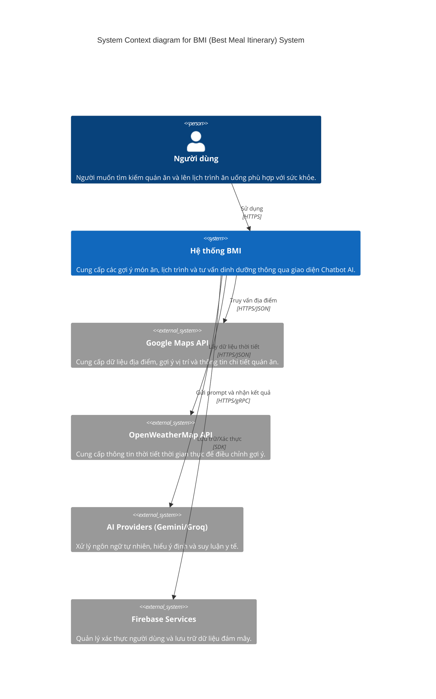

# BMI - Best Meal Itinerary 🍱✈️

**BMI (Best Meal Itinerary)** là hệ thống trợ lý du lịch và ăn uống thông minh, giúp người dùng tìm kiếm, lên lịch trình ăn uống cá nhân hóa dựa trên sở thích, ngân sách, vị trí và đặc biệt là **tình trạng sức khỏe**.

[](https://www.python.org/downloads/)
[](https://fastapi.tiangolo.com/)
[](https://nextjs.org/)
[](https://tailwindcss.com/)

---

## 🌟 Tính năng nổi bật

- **Chatbot AI Thông Minh**: Tích hợp Google Gemini & Groq để hiểu ý định người dùng (Intent Routing), tư vấn dinh dưỡng và gợi ý quán ăn.
- **Cá nhân hóa theo Sức khỏe**: Hệ thống tự động lọc các món ăn/quán ăn chứa thành phần gây dị ứng hoặc không phù hợp với bệnh lý (Gout, Tiểu đường, Dạ dày, v.v.).
- **Lên lịch trình (Itinerary Management)**: Tự động sắp xếp các bữa ăn trong ngày, cho phép tùy chỉnh, thay đổi thứ tự và chia sẻ lịch trình với bạn bè.
- **Tìm kiếm ngữ nghĩa (Semantic Search)**: Sử dụng Vector Database (ChromaDB) và Sentence Transformers để tìm kiếm quán ăn theo mô tả tự nhiên nhất.
- **Bản đồ tương tác**: Tích hợp Google Maps API để gợi ý vị trí và hiển thị trực quan các quán ăn xung quanh.
- **Cơ chế Cache thông minh**: Sử dụng Semantic Cache để tối ưu tốc độ phản hồi cho các yêu cầu tương tự.
- **Tương tác cộng đồng**: Cho phép người dùng bình luận, đánh giá (like/dislike) các quán ăn.

---

## 🏗️ Kiến trúc hệ thống

Dưới đây là sơ đồ ngữ cảnh (System Context) của hệ thống BMI:



---

## 💻 Công nghệ sử dụng

### Backend
- **Framework**: FastAPI (Python)
- **AI/LLM**: Google Gemini API, Groq Cloud API
- **Vector DB**: ChromaDB
- **Embedding**: Sentence-Transformers (all-MiniLM-L6-v2)
- **Database**: Firebase Firestore (User Profiles, Chat History, Comments)
- **Libraries**: Pandas, Numpy, Pydantic, Httpx, Tenacity

### Frontend
- **Framework**: Next.js 14 (App Router)
- **Styling**: Tailwind CSS, Framer Motion
- **Map**: MapLibre GL, React-map-gl
- **State/Auth**: Firebase Auth, React Context API
- **Components**: Lucide React, SweetAlert2

---

## 🚀 Hướng dẫn cài đặt và Chạy code

### 1. Yêu cầu hệ thống
- Python 3.9 trở lên
- Node.js 18 trở lên
- Tài khoản Firebase (để lấy config)
- API Keys: Google AI Studio (Gemini), Groq, Google Maps.

### 2. Cài đặt Backend
```bash
# Cài đặt các thư viện cần thiết
pip install -r requirements.txt

# Tạo file .env từ .env.example và điền các API Key
cp .env.example .env
```

### 3. Cài đặt Frontend
```bash
cd FrontEnd
npm install
# Cài đặt thêm nếu thiếu firebase
npm install firebase

# Tạo file .env.local và thêm URL Backend
echo "NEXT_PUBLIC_API_URL=http://localhost:8000" > .env.local
```

### 4. Khởi chạy hệ thống
Cần khởi chạy 2 Terminal song song:

**Terminal 1: Chạy Backend**
```bash
# Lưu ý: Cần chạy khởi tạo dữ liệu trước (lần đầu)
python Back_End/Database/database.py

# Chạy server FastAPI
uvicorn main:app --reload
```

**Terminal 2: Chạy Frontend**
```bash
cd FrontEnd
npm run dev
```

---

## 📂 Cấu trúc thư mục

```text
.
├── Back_End/               # Mã nguồn Backend
│   ├── API/                # Các routes chính (Auth, Share, Main Pipeline)
│   ├── Core/               # Logic cốt lõi (Parsing, Scoring, Filtering, AI)
│   ├── Database/           # Quản lý ChromaDB và kết nối Firestore
│   └── UnitTest/           # Các bản kiểm thử đơn vị
├── FrontEnd/               # Mã nguồn Frontend (Next.js)
│   ├── src/app/            # Các trang giao diện
│   ├── src/components/     # UI Components
│   └── src/lib/            # API client và Utils
├── data/                   # Dữ liệu JSON thô của các khu vực (HCM, HN, Đà Nẵng...)
├── main.py                 # Entry point của FastAPI
└── requirements.txt        # Các dependencies Python
```

---

## 🛠️ Hướng dẫn sử dụng

1. **Đăng nhập**: Sử dụng tài khoản Google hoặc Email thông qua Firebase.
2. **Thiết lập hồ sơ sức khỏe**: Vào mục **Hồ sơ sức khỏe** để chọn các dị ứng hoặc bệnh lý. Hệ thống sẽ ghi nhớ để lọc quán ăn phù hợp.
3. **Trò chuyện & Tìm kiếm**:
   - Nhập yêu cầu như: *"Tìm quán bún chả Hà Nội giá rẻ cho 2 người ở Quận 1"*
   - AI sẽ tự động phân tích và đưa ra các lựa chọn tốt nhất.
4. **Lên lịch trình**: Nhấn **"Thêm vô lịch trình"** để lưu quán ăn. Bạn có thể xem toàn bộ lộ trình trong ngày tại bảng điều khiển.
5. **Chia sẻ**: Tạo mã chia sẻ để gửi lộ trình cho bạn bè cùng tham gia chuyến đi.

---

## 🤝 Đóng góp
Dự án đang trong giai đoạn phát triển. Mọi đóng góp về code, báo lỗi hoặc gợi ý tính năng mới đều được chào đón!

---

## 📜 Giấy phép
Dự án này thuộc bản quyền của team **24ctt6-tdtt**.

*Chúc bạn có những trải nghiệm ẩm thực tuyệt vời cùng BMI!* 🍜✨
