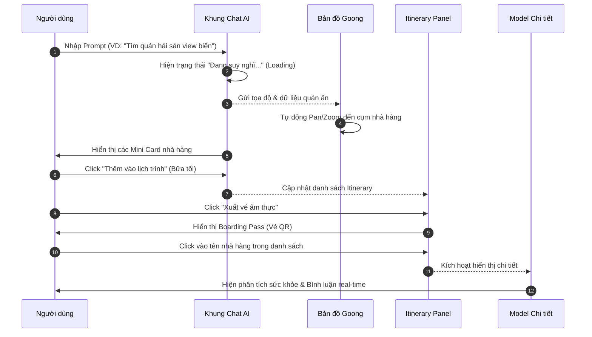

# Sơ đồ Luồng Tương tác Giao diện (UI User Flow Diagram)

Sơ đồ này minh họa hành trình từ lúc người dùng nhập yêu cầu cho đến khi xem chi tiết và lưu lịch trình ẩm thực.

```mermaid
sequenceDiagram
    autonumber
    participant U as Người dùng
    participant Chat as Khung Chat AI
    participant Map as Bản đồ Goong
    participant Pnl as Itinerary Panel
    participant Modal as Model Chi tiết

    U->>Chat: Nhập Prompt (VD: "Tìm quán hải sản view biển")
    Chat->>Chat: Hiện trạng thái "Đang suy nghĩ..." (Loading)
    Chat-->>Map: Gửi tọa độ & dữ liệu quán ăn
    Map->>Map: Tự động Pan/Zoom đến cụm nhà hàng
    Chat->>U: Hiển thị các Mini Card nhà hàng
    U->>Chat: Click "Thêm vào lịch trình" (Bữa tối)
    Chat-->>Pnl: Cập nhật danh sách Itinerary
    U->>Pnl: Click "Xuất vé ẩm thực"
    Pnl->>U: Hiển thị Boarding Pass (Vé QR)
    U->>Pnl: Click vào tên nhà hàng trong danh sách
    Pnl-->>Modal: Kích hoạt hiển thị chi tiết
    Modal->>U: Hiện phân tích sức khỏe & Bình luận real-time
```
